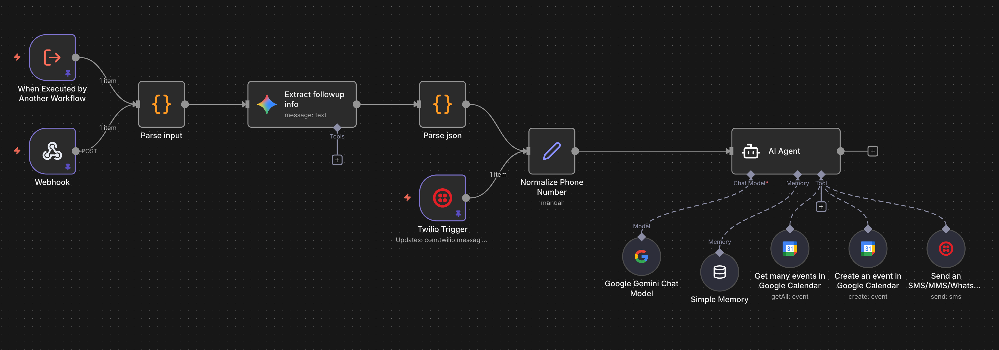
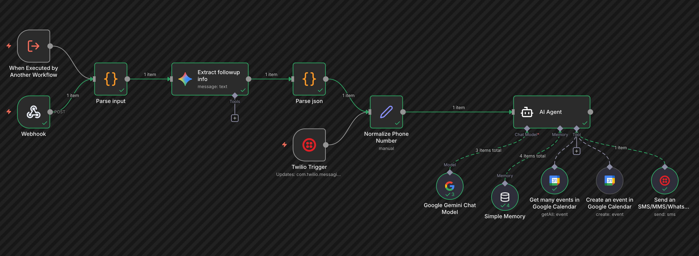
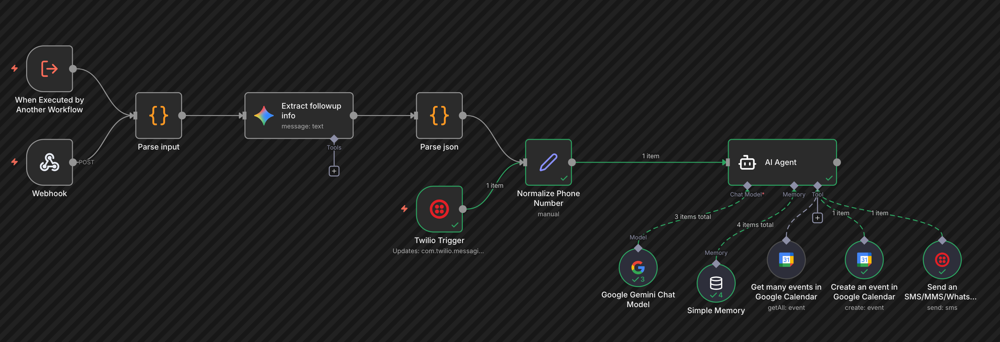

# Medical Follow-Up Scheduling Workflow: Technical Documentation

## Executive Overview

This document provides comprehensive technical documentation for an n8n-based automated medical follow-up scheduling system. The workflow uses AI agents to orchestrate patient communication via WhatsApp and appointment booking via Google Calendar.

**Purpose:** Automate the process of detecting follow-up requirements from medical notes, communicating with patients, and scheduling appointments without manual intervention.

**Status:** Conceptual prototype/demo (not production-ready)

**Technology Stack:**
- n8n (workflow orchestration)
- Google Gemini 2.5 Pro (AI reasoning)
- Twilio WhatsApp API (patient communication)
- Google Calendar API (scheduling)
- LangChain (AI agent framework)

---

## Table of Contents

1. [Architecture & Execution Model](#architecture--execution-model)
2. [N8N Concepts Primer](#n8n-concepts-primer)
3. [Node-by-Node Documentation](#node-by-node-documentation)
4. [Data Flow & State Management](#data-flow--state-management)
5. [External Integrations Deep Dive](#external-integrations-deep-dive)
6. [Edge Cases & Gotchas](#edge-cases--gotchas)
7. [Production Hardening Recommendations](#production-hardening-recommendations)

---

## Architecture & Execution Model

### Overview



This workflow operates as a **dual-entry-point state machine** with two distinct execution paths that share a common AI agent core:

```
┌─────────────────────────────────────────────────────────────┐
│                    WORKFLOW ARCHITECTURE                     │
├─────────────────────────────────────────────────────────────┤
│                                                               │
│  PATH 1: Follow-Up Initiation (Workflow Trigger)            │
│  ┌─────────────────────────────────────────────────┐        │
│  │ Upstream Workflow → Execute Workflow Trigger    │        │
│  │         ↓                                         │        │
│  │ Extract Follow-Up Info (Gemini)                  │        │
│  │         ↓                                         │        │
│  │ Parse JSON (Code Node)                           │        │
│  │         ↓                                         │        │
│  │ Normalize Phone Number (Set Node)                │        │
│  │         ↓                                         │        │
│  │ AI Agent (with tools) → Send WhatsApp Message    │        │
│  └─────────────────────────────────────────────────┘        │
│                                                               │
│  PATH 2: Patient Reply Handling (Twilio Trigger)            │
│  ┌─────────────────────────────────────────────────┐        │
│  │ Patient WhatsApp Reply → Twilio Webhook         │        │
│  │         ↓                                         │        │
│  │ Normalize Phone Number (Set Node)                │        │
│  │         ↓                                         │        │
│  │ AI Agent (with tools) → Book Calendar Event      │        │
│  │         ↓                                         │        │
│  │ Send Confirmation WhatsApp                        │        │
│  └─────────────────────────────────────────────────┘        │
│                                                               │
│  SHARED COMPONENTS:                                          │
│  • AI Agent (Gemini-powered decision engine)                 │
│  • Simple Memory (conversation context)                      │
│  • Google Calendar Tools (availability check + booking)      │
│  • Twilio Tool (WhatsApp messaging)                          │
└─────────────────────────────────────────────────────────────┘
```

### Why Two Entry Points?

The workflow is split into two triggers because:

1. **Different Data Sources:** Path 1 receives structured data from an upstream note-generation workflow, while Path 2 receives webhook events from Twilio's WhatsApp API.

2. **N8N Execution Model:** In n8n, workflows are **event-driven**. Each execution is triggered by a single triggering event. Multiple triggers in one workflow allow the same logic (the AI Agent) to respond to different event types.

3. **State Separation:** Each path represents a different phase in the conversation:
   - **Path 1 (init_follow_up mode):** The system initiates contact with the patient
   - **Path 2 (handle_reply mode):** The system responds to patient input

4. **Webhook Requirements:** Twilio requires a dedicated webhook URL to send inbound messages. This necessitates a trigger node that generates a stable webhook endpoint.

### Execution Flow

**Path 1 Execution (Follow-Up Initiation):**
1. Upstream workflow completes and calls this workflow via "Execute Workflow" node
2. Medical note data flows through follow-up extraction and parsing
3. Data is normalized and enriched with context (patient name, phone, doctor name)
4. AI Agent receives mode="init_follow_up" and follow-up details
5. Agent queries Google Calendar for availability
6. Agent writes proposed slots to memory (session key = patient phone number)
7. Agent sends WhatsApp message with available slots
8. Execution ends



**Path 2 Execution (Patient Reply):**
1. Patient responds to WhatsApp message
2. Twilio webhook fires and triggers workflow
3. Patient phone number is normalized from webhook data
4. AI Agent receives mode="handle_reply" and patient message
5. Agent reads memory using patient phone number as session key
6. Agent interprets patient's choice and maps it to a time slot
7. Agent creates Google Calendar event
8. Agent sends WhatsApp confirmation
9. Execution ends



**Critical Insight:** The two executions are **independent processes** connected only through the Simple Memory node, which persists data between executions using the patient's phone number as the session key.

---

## N8N Concepts Primer

For developers new to n8n, this section explains the platform-specific concepts used in this workflow.

### Trigger Nodes vs Execution Nodes

**Trigger Nodes:**
- Start a workflow execution
- Respond to external events (webhooks, schedules, manual triggers)
- Supply the initial data payload to the workflow
- A workflow can have multiple triggers, but only one fires per execution
- **In this workflow:** "When Executed by Another Workflow", "Twilio Trigger", and "Webhook" are triggers

**Execution Nodes:**
- Perform operations during workflow execution
- Process data, call APIs, transform inputs
- Execute sequentially after the trigger fires
- **In this workflow:** All other nodes (AI Agent, Set, Code, etc.) are execution nodes

**Documentation:** [Manual, partial, and production executions | n8n Docs](https://docs.n8n.io/workflows/executions/manual-partial-and-production-executions/)

### AI Agent Node

The AI Agent is a **root node** that orchestrates an LLM-based reasoning engine using LangChain's framework. It can:
- Receive a user prompt
- Reason about the task
- Invoke connected tools (sub-nodes)
- Return a response

**Key Characteristics:**
- Uses the **Tools Agent** pattern (as of n8n v1.82.0+, the Conversational Agent was removed)
- Can autonomously decide which tools to call and when
- Receives input via the `text` parameter (from upstream nodes)
- Returns structured output or tool invocation results

**In this workflow:**
- The AI Agent receives either follow-up details (Path 1) or patient messages (Path 2)
- It's connected to 4 tools: Google Calendar (get events), Google Calendar (create event), Twilio (send WhatsApp), and Simple Memory
- The system message provides detailed instructions for two operational modes

**Documentation:** [AI Agent node documentation | n8n Docs](https://docs.n8n.io/integrations/builtin/cluster-nodes/root-nodes/n8n-nodes-langchain.agent/)

### Tool Nodes

Tool nodes are **sub-nodes** that connect to AI Agents. They expose specific capabilities that the agent can invoke during reasoning.

**How Tools Work:**
1. Each tool has a description that the agent uses to understand when to invoke it
2. Tools have parameters that the agent must populate
3. The agent uses the `$fromAI()` function to dynamically extract parameter values from context

**The $fromAI() Function:**
```javascript
$fromAI('ParameterName', 'default_value', 'type')
```

This function tells n8n: "Let the AI model fill this parameter based on the conversation context."

**Example from this workflow:**
```javascript
summary: "={{ $fromAI('Summary', '', 'string') }}"
start: "={{ $fromAI('Start', '', 'string') }}"
end: "={{ $fromAI('End', '', 'string') }}"
```

When the agent decides to create a calendar event, it analyzes the conversation and fills these parameters with appropriate values (e.g., "Follow-up – Connie", "2025-12-27T10:00:00", "2025-12-27T10:30:00").

**Documentation:**
- [Let AI specify tool parameters | n8n Docs](https://docs.n8n.io/advanced-ai/examples/using-the-fromai-function/)
- [What's a tool in AI? | n8n Docs](https://docs.n8n.io/advanced-ai/examples/understand-tools/)

### Simple Memory (Window Buffer Memory)

The Simple Memory node provides **conversational context** to the AI Agent. It stores recent interactions so the agent can maintain continuity across tool invocations or even across separate workflow executions.

**Key Parameters:**
- `sessionKey`: Determines which conversation this memory belongs to
- `contextWindowLength`: Number of recent interactions to remember

**In this workflow:**
```javascript
sessionKey: "={{ $json.patient_phone }}"
contextWindowLength: 1
```

**How It Works:**
- When the agent writes to memory (in Path 1), it stores the message under the patient's phone number
- When the agent reads from memory (in Path 2), it retrieves data using the same phone number
- With `contextWindowLength: 1`, only the most recent interaction is kept

**Critical Limitation:** Simple Memory uses **in-memory storage** by default. This means:
- Data persists only while the n8n instance is running
- If n8n restarts, all memory is lost
- For production, you'd need to use a persistent memory backend (e.g., Postgres Chat Memory)

**Documentation:**
- [Simple Memory node documentation | n8n Docs](https://docs.n8n.io/integrations/builtin/cluster-nodes/sub-nodes/n8n-nodes-langchain.memorybufferwindow/)
- [Simple Memory node common issues | n8n Docs](https://docs.n8n.io/integrations/builtin/cluster-nodes/sub-nodes/n8n-nodes-langchain.memorybufferwindow/common-issues/)

### Session Keys and Memory Scoping

**Session Key Concept:**
The session key is a string that uniquely identifies a conversation. In this workflow, it's the patient's phone number.

**Why per-phone-number instead of per-appointment?**
This is a **deliberate design choice** mentioned in the requirements. The memory is scoped to the phone number, meaning:
- If the same patient has multiple follow-ups, they'll share memory (could be problematic)
- If different patients have the same phone, they'd collide (unlikely but possible)

**Best Practice for Production:**
Use a composite key like `${patientId}_${appointmentId}` to uniquely scope each follow-up conversation.

### N8N Expression Syntax

Throughout the workflow, you'll see expressions like:
```javascript
"={{ $json.field_name }}"
"={{ $if(condition, valueIfTrue, valueIfFalse) }}"
```

**Key Patterns:**
- `={{ ... }}`: Evaluates a JavaScript expression
- `$json`: Refers to the current item's JSON data
- `$('NodeName')`: References output from another node
- `$('NodeName').isExecuted`: Checks if a node ran in this execution
- `$if(condition, a, b)`: Ternary conditional (equivalent to `condition ? a : b`)

**In this workflow:**
The "Normalize Phone Number" node uses complex expressions to route data from either trigger:
```javascript
patient_phone: "={{ $if($('When Executed by Another Workflow').isExecuted,
                     $('When Executed by Another Workflow').item.json.form.json['Patient Phone No.'],
                     $json.data.from.split(':')[1].replace('+91', '')) }}"
```

This means: "If the workflow trigger fired, get the phone from form data; otherwise, extract it from the Twilio webhook payload."

---

## Node-by-Node Documentation

This section documents every node in the workflow with input/output schemas, purpose, and downstream effects.

### 1. When Executed by Another Workflow

**Type:** `n8n-nodes-base.executeWorkflowTrigger`
**Version:** 1.1
**Position:** Entry Point (Path 1)

**Purpose:**
Allows an upstream workflow (the note generation pipeline) to trigger this workflow and pass data to it.

**Configuration:**
```json
{
  "inputSource": "passthrough"
}
```
This means the trigger accepts whatever data the calling workflow sends.

**Input Data (from upstream workflow):**
```javascript
{
  form: {
    json: {
      "Select Doctor": "Dr. Rishabh",
      "Patient Name": "Connie",
      "Patient Phone No.": 7899654883,
      "Doctor Email": "rishabh@navadhiti.com",
      "submittedAt": "2025-12-20T07:29:53.198+05:30",
      // ... other form fields
    }
  },
  generated_note: [
    {
      title: "Chief Complaint",
      content: "Patient presents for a routine two-week post-operative follow-up...",
      // ... other note sections
    },
    {
      title: "Plan",
      content: "- Return to clinic in 6 weeks.",
      // ...
    }
  ]
}
```

**Output:**
Passes the entire payload to the next node ("Extract followup info").

**Downstream Nodes:**
- Extract followup info (main connection)

**Notes:**
- This trigger does NOT fire when Twilio webhook executes
- The `pinData` in the JSON shows test data for development

---

### 2. Extract followup info

**Type:** `@n8n/n8n-nodes-langchain.googleGemini`
**Version:** 1
**Position:** Path 1, Step 1

**Purpose:**
Uses Google Gemini LLM to analyze the medical note and extract follow-up requirements.

**Configuration:**
```json
{
  "modelId": "models/gemini-2.5-pro",
  "messages": [
    {
      "content": "You will analyze a structured medical note provided as JSON..."
    }
  ],
  "jsonOutput": true
}
```

**Input Data:**
Receives `$json.generated_note` from the trigger (the structured medical note array).

**Processing Logic:**
The prompt instructs Gemini to:
1. Search all fields in the medical note for follow-up instructions
2. Identify phrases like "Return to clinic in X weeks", "Follow up in X months", "RTC in X days"
3. Extract the exact interval as stated by the doctor
4. Determine the reason for follow-up based on context
5. Output a structured JSON object

**Example Prompt Section:**
```
Search ALL fields of the medical note for follow-up instructions.
A follow-up may appear as:
- "Return to clinic in X weeks/months/days."
- "Follow up in X weeks/months/days."
- "RTC in X weeks."
- "Follow up as needed."

Output ONLY the JSON object with the following keys:
{
  "follow_up_required": boolean,
  "follow_up_interval": string,
  "follow_up_reason": string,
  "raw_follow_up_text": string
}
```

**Output Data Example:**
```json
{
  "content": {
    "parts": [
      {
        "text": "{\"follow_up_required\":true,\"follow_up_interval\":\"6 weeks\",\"follow_up_reason\":\"Post-operative follow-up for left total hip replacement\",\"raw_follow_up_text\":\"Return to clinic in 6 weeks.\"}"
      }
    ]
  }
}
```

**Downstream Nodes:**
- Parse json

**Key Design Decisions:**
- Uses `jsonOutput: true` to ensure structured output
- The prompt explicitly instructs Gemini NOT to transform units (e.g., don't convert "6 weeks" to "42 days")
- Handles "as needed" as a valid interval

---

### 3. Parse json

**Type:** `n8n-nodes-base.code`
**Version:** 2
**Position:** Path 1, Step 2

**Purpose:**
Extracts the JSON string from Gemini's response and parses it into a JavaScript object.

**Code:**
```javascript
const text = $input.first().json.content.parts[0].text
return {"follow_up_details" : JSON.parse(text)};
```

**Input Data:**
Receives the output from "Extract followup info" (Gemini's response).

**Processing Logic:**
1. Accesses the first item's JSON data
2. Navigates to `content.parts[0].text` (where Gemini puts the response)
3. Parses the JSON string
4. Wraps it in a `follow_up_details` object

**Output Data:**
```json
{
  "follow_up_details": {
    "follow_up_required": true,
    "follow_up_interval": "6 weeks",
    "follow_up_reason": "Post-operative follow-up for left total hip replacement",
    "raw_follow_up_text": "Return to clinic in 6 weeks."
  }
}
```

**Downstream Nodes:**
- Normalize Phone Number

**Error Handling:**
None. If Gemini returns malformed JSON, this node will throw a parse error and halt the workflow.

**Production Considerations:**
- Should add try-catch for JSON.parse
- Should validate the structure of parsed data
- Should handle cases where Gemini returns text instead of JSON

---

### 4. Twilio Trigger

**Type:** `n8n-nodes-base.twilioTrigger`
**Version:** 1
**Position:** Entry Point (Path 2)

**Purpose:**
Creates a webhook endpoint that Twilio calls when a WhatsApp message is received.

**Configuration:**
```json
{
  "updates": ["com.twilio.messaging.inbound-message.received"]
}
```

**Webhook Details:**
- **Webhook ID:** `530021b9-4680-4fed-86ad-577fd4a976c6`
- **URL Format:** `https://your-n8n-instance/webhook-test/twilio-trigger/[webhookId]`

**Input Data (from Twilio):**
```json
{
  "specversion": "1.0",
  "type": "com.twilio.messaging.inbound-message.received",
  "data": {
    "messageSid": "SM469e0b7b5b0783490292ef3fc15a4a02",
    "body": "I want 2",
    "from": "whatsapp:+917899654883",
    "to": "whatsapp:+14155238886",
    "timestamp": "2025-12-20T01:59:43.000Z",
    "numMedia": 0,
    "numSegments": 1
  }
}
```

**Key Fields:**
- `data.body`: The patient's message text
- `data.from`: Sender's WhatsApp number (format: "whatsapp:+[country_code][number]")
- `data.to`: Your Twilio WhatsApp number
- `data.timestamp`: When the message was sent

**Output:**
Passes the entire Twilio webhook payload to the next node.

**Downstream Nodes:**
- Normalize Phone Number

**Setup Requirements:**
1. Twilio account with WhatsApp sandbox or approved WhatsApp number
2. Webhook URL configured in Twilio console
3. n8n instance must be publicly accessible

**Important Limitations:**
- Twilio WhatsApp Sandbox has messaging limits (good for testing only)
- Each WhatsApp-enabled Twilio number can only have ONE webhook URL
- If you change the webhook URL in n8n (e.g., by deactivating/reactivating), you must update Twilio

**Documentation:** [Webhook and Twilio: Automate Workflows with n8n](https://n8n.io/integrations/webhook/and/twilio/)

---

### 5. Webhook

**Type:** `n8n-nodes-base.webhook`
**Version:** 2.1
**Position:** Alternative Entry Point

**Purpose:**
Provides a generic HTTP POST endpoint for testing or alternative integrations.

**Configuration:**
```json
{
  "httpMethod": "POST",
  "path": "book-appointment",
  "responseMode": "lastNode",
  "responseData": "noData"
}
```

**Webhook URL:**
`https://your-n8n-instance/webhook/book-appointment`

**Current Status:**
This node exists in the workflow but is **not connected** to any downstream nodes. It appears to be a legacy or alternative entry point.

**Potential Use Case:**
Could be used for:
- Direct API calls to trigger follow-up initiation
- Testing without depending on the upstream workflow
- Integration with third-party systems

**Downstream Nodes:**
- Extract followup info (visible in connections but may be an alternative path)

---

### 6. Normalize Phone Number

**Type:** `n8n-nodes-base.set`
**Version:** 3.4
**Position:** Path Convergence Point

**Purpose:**
This is the **critical node** where both execution paths converge. It normalizes data from either trigger into a consistent format for the AI Agent.

**Configuration:**
```json
{
  "assignments": [
    {
      "name": "patient_phone",
      "value": "={{ $if($('When Executed by Another Workflow').isExecuted,
                     $('When Executed by Another Workflow').item.json.form.json['Patient Phone No.'],
                     $json.data.from.split(':')[1].replace('+91', '')) }}",
      "type": "string"
    },
    {
      "name": "context_data",
      "value": "={{ $if($('When Executed by Another Workflow').isExecuted,
                     'follow_up_details:\\n' + JSON.stringify($json.follow_up_details) + '\\n\\nDoctor name: ' + ...,
                     'Patient WhatsApp message: ' + $json.data.body) }}",
      "type": "string"
    },
    {
      "name": "mode",
      "value": "={{ $if($('When Executed by Another Workflow').isExecuted,
                     'init_follow_up',
                     'handle_reply') }}",
      "type": "string"
    }
  ],
  "includeOtherFields": true
}
```

**Logic Breakdown:**

**Field 1: patient_phone**
- **If Path 1 (Workflow Trigger):** Extract from form data: `form.json['Patient Phone No.']`
- **If Path 2 (Twilio Trigger):** Parse from webhook: `data.from.split(':')[1].replace('+91', '')`
- **Example Output:** `"7899654883"`

**Field 2: context_data**
- **If Path 1:** Format as:
  ```
  follow_up_details:
  {follow-up JSON}

  Doctor name: Dr. Rishabh
  Patient name: Connie
  Submission time and date: 2025-12-20T07:29:53.198+05:30
  ```
- **If Path 2:** Format as:
  ```
  Patient WhatsApp message: I want 2
  ```

**Field 3: mode**
- **If Path 1:** `"init_follow_up"`
- **If Path 2:** `"handle_reply"`

**Output Data (Path 1 Example):**
```json
{
  "patient_phone": "7899654883",
  "context_data": "follow_up_details:\n{\"follow_up_required\":true,\"follow_up_interval\":\"6 weeks\",...}\n\nDoctor name: Dr. Rishabh\nPatient name: Connie\nSubmission time and date: 2025-12-20T07:29:53.198+05:30",
  "mode": "init_follow_up",
  "follow_up_details": { ... }  // Included via "includeOtherFields": true
}
```

**Output Data (Path 2 Example):**
```json
{
  "patient_phone": "7899654883",
  "context_data": "Patient WhatsApp message: I want 2",
  "mode": "handle_reply",
  "data": { ... }  // Included via "includeOtherFields": true
}
```

**Downstream Nodes:**
- AI Agent

**Why This Node Is Critical:**
- It's the **single point of truth** for mode detection
- It normalizes phone numbers from different formats
- It creates the `context_data` string that the AI Agent uses as its input
- It preserves all original fields via `includeOtherFields: true`

---

### 7. AI Agent

**Type:** `@n8n/n8n-nodes-langchain.agent`
**Version:** 3
**Position:** Core Decision Engine

**Purpose:**
The central intelligence of the workflow. This agent orchestrates all follow-up scheduling logic using natural language reasoning and tool invocation.

**Configuration:**

**Prompt Type:** `define` (manually specified)

**Input Prompt:**
```javascript
"={{ $json.context_data }}\n\n\"If mode = init_follow_up, ignore memory reads and only write.\""
```

The agent receives the normalized `context_data` plus an instruction about memory usage.

**System Message:**
The system message is extensive (22 lines) and defines two operational modes with detailed instructions. Key sections:

**Preamble:**
```
You are an autonomous clinical workflow assistant responsible for
managing patient follow-up scheduling on behalf of the doctor.

Your goals:
1. Read the follow_up_details JSON and understand whether a follow-up is required.
2. If required, determine appropriate date ranges using the follow_up_interval.
3. Query Google Calendar for availability using the provided calendar tools.
4. Compose clear, concise WhatsApp messages that the patient can understand easily.
...
```

**MODE 1 — FOLLOW-UP INITIATION (Workflow B1):**
```
This mode is active when:
- follow_up_details is present
- There is NO incoming patient message

Your responsibilities in this mode:
1. Inspect follow_up_details.
2. If follow_up_details.follow_up_required is FALSE:
   - Do nothing.
   - Return a short assistant message: "No follow-up required."

3. If follow_up_details.follow_up_required is TRUE:
   a. Convert follow_up_interval into a reasonable date range.
   b. Use the Google Calendar availability tool to find available time slots.
   c. Select 2–5 appropriate slots.
   d. Draft a clear, patient-friendly WhatsApp message listing the slots.
      - The message must ask the patient to reply with a simple choice (e.g., "1", "2", "3").
   e. BEFORE sending the message:
      - Write the drafted message AND the list of proposed slots into memory.
      - Do NOT read from memory in this mode.
   f. Send the message to the patient using the Twilio WhatsApp Send Message tool.

End execution after sending the message.
```

**MODE 2 — PATIENT REPLY HANDLING (Workflow B2):**
```
This mode is active when:
- An incoming WhatsApp message from the patient is present
- follow_up_details is NOT present

Your responsibilities in this mode:
1. Read the incoming patient message.
2. Retrieve prior context from memory, including:
   - The previously sent WhatsApp message
   - The list of proposed appointment slots
3. Interpret the patient's response and determine which slot they selected.
   - Handle variations such as:
     "1", "2", "the second one", "11am works", "tomorrow morning", etc.
4. Create a calendar event using the Google Calendar create-event tool:
   - Title format: "Follow-up – [Patient Name]"
   - Use the selected slot for start/end time.
5. Draft a short WhatsApp confirmation message confirming the booking.
6. Send the confirmation to the patient using the Twilio WhatsApp Send Message tool.
...

End execution after sending the confirmation.
```

**GLOBAL RULES:**
```
- Always use tools for calendar actions and WhatsApp messaging.
- Never send raw JSON in assistant messages.
- Keep patient-facing messages short, friendly, and easy to respond to.
- Never invent data not present in input or memory.
- Memory is authoritative for prior messages and slot context.
```

**Connected Sub-Nodes:**
1. **Google Gemini Chat Model** (LLM)
2. **Simple Memory** (conversation context)
3. **Create an event in Google Calendar** (tool)
4. **Get many events in Google Calendar** (tool)
5. **Send an SMS/MMS/WhatsApp message in Twilio** (tool)

**Input Data:**
Receives the output from "Normalize Phone Number":
```json
{
  "patient_phone": "7899654883",
  "context_data": "...",
  "mode": "init_follow_up" | "handle_reply"
}
```

**Output Data:**
The AI Agent's output depends on the LLM's decisions and tool invocations. It could include:
- Tool invocation results (calendar events created, messages sent)
- Assistant messages
- Error states

**Execution Flow:**

**In Mode 1 (init_follow_up):**
1. Agent parses `follow_up_details` from context_data
2. Checks if `follow_up_required` is true
3. Calculates date range (e.g., "6 weeks" → start: today + 5 weeks, end: today + 7 weeks)
4. Invokes "Get many events in Google Calendar" tool with date range
5. Analyzes busy/free blocks to find 2-5 available slots
6. Formats slots as a patient-friendly message
7. Writes message + slot list to memory (using patient_phone as session key)
8. Invokes "Send an SMS/MMS/WhatsApp message in Twilio" tool
9. Returns execution result

**In Mode 2 (handle_reply):**
1. Agent reads patient message from context_data ("I want 2")
2. Invokes memory to retrieve previously sent message and slot list
3. Interprets "2" to mean the second slot (e.g., "Dec 27, 11:00 AM")
4. Invokes "Create an event in Google Calendar" with:
   - summary: "Follow-up – Connie"
   - start: "2025-12-27T11:00:00"
   - end: "2025-12-27T11:30:00"
5. Formats confirmation message
6. Invokes "Send an SMS/MMS/WhatsApp message in Twilio"
7. Returns execution result

**Why This Design Works:**
- The agent doesn't need explicit branching logic; it follows the mode instructions
- The system message encodes all business logic
- Tools abstract away API complexity
- The agent can handle natural language variations ("the second one" vs "2" vs "11am")

---

### 8. Google Gemini Chat Model

**Type:** `@n8n/n8n-nodes-langchain.lmChatGoogleGemini`
**Version:** 1
**Position:** Sub-node (connected to AI Agent)

**Purpose:**
Provides the LLM (Large Language Model) that powers the AI Agent's reasoning.

**Configuration:**
```json
{
  "modelName": "models/gemini-2.5-pro",
  "options": {}
}
```

**Credentials:**
Uses "Google Gemini(PaLM) Api account" credentials (OAuth or API key).

**Model Characteristics (Gemini 2.5 Pro):**
- Context window: 2 million tokens (extremely large)
- Supports function calling (required for tool use)
- Strong reasoning capabilities
- JSON output mode
- Multimodal (though not used here)

**Why Gemini 2.5 Pro?**
- Cost-effective for high-volume workflows
- Excellent at structured output (important for follow-up extraction)
- Native function calling support for tool orchestration

**Connection Type:** `ai_languageModel`
This is a special connection type in n8n that links LLMs to agent nodes.

**Documentation:** [AI Agent node documentation | n8n Docs](https://docs.n8n.io/integrations/builtin/cluster-nodes/root-nodes/n8n-nodes-langchain.agent/)

---

### 9. Simple Memory

**Type:** `@n8n/n8n-nodes-langchain.memoryBufferWindow`
**Version:** 1.3
**Position:** Sub-node (connected to AI Agent)

**Purpose:**
Stores and retrieves conversation context between workflow executions.

**Configuration:**
```json
{
  "sessionIdType": "customKey",
  "sessionKey": "={{ $json.patient_phone }}",
  "contextWindowLength": 1
}
```

**Parameter Breakdown:**

**sessionIdType: "customKey"**
Uses a custom session identifier (not the default workflow execution ID).

**sessionKey: "={{ $json.patient_phone }}"**
The session is scoped to the patient's phone number. This means:
- All follow-up conversations for patient "7899654883" share the same memory
- Different patients have separate memory contexts
- Memory persists across the two workflow executions (init and reply)

**contextWindowLength: 1**
Only the most recent interaction is kept in context. This means:
- In Path 1, the agent writes 1 interaction (the proposed slots message)
- In Path 2, the agent reads that 1 interaction
- If the patient sends multiple messages, only the last exchange is remembered

**Memory Structure:**
```javascript
{
  sessionId: "7899654883",
  messages: [
    {
      role: "assistant",
      content: "Hi Connie, Dr. Rishabh would like to schedule a follow-up..."
    }
  ]
}
```

**Connection Type:** `ai_memory`
Links memory stores to agent nodes.

**Critical Limitations:**
1. **Non-persistent by default:** Uses in-memory storage (lost on n8n restart)
2. **No data expiration:** Memory persists indefinitely (until n8n restarts)
3. **Collision risk:** If two patients have the same phone, they'd share memory

**Production Alternative:**
For production, use **Postgres Chat Memory** node:
```json
{
  "sessionIdType": "customKey",
  "sessionKey": "={{ $json.patient_phone }}",
  "tableName": "patient_conversations",
  "contextWindowLength": 5
}
```

**Documentation:** [Simple Memory node documentation | n8n Docs](https://docs.n8n.io/integrations/builtin/cluster-nodes/sub-nodes/n8n-nodes-langchain.memorybufferwindow/)

---

### 10. Get many events in Google Calendar

**Type:** `n8n-nodes-base.googleCalendarTool`
**Version:** 1.3
**Position:** Tool (connected to AI Agent)

**Purpose:**
Allows the AI Agent to query the doctor's calendar for availability within a date range.

**Configuration:**
```json
{
  "descriptionType": "manual",
  "toolDescription": "Use this tool to get the doctor's availability. Provide a startDate and endDate. The tool returns busy and free blocks. Only use this tool when determining available follow-up appointment slots.",
  "operation": "getAll",
  "calendar": "rishabh4883@gmail.com",
  "limit": "={{ $fromAI('Limit', '', 'number') }}",
  "timeMin": "={{ $fromAI('After', '', 'string') }}",
  "timeMax": "={{ $fromAI('Before', '', 'string') }}"
}
```

**Tool Description:**
The description tells the agent when and how to use this tool. It's crucial because the agent uses this text to decide whether to invoke the tool.

**Parameters Filled by AI:**
- `limit`: Maximum number of events to return (agent decides based on context)
- `timeMin`: Start of date range (agent calculates from follow_up_interval)
- `timeMax`: End of date range (agent calculates from follow_up_interval)

**Example Agent Invocation:**
If the follow-up is "6 weeks", the agent might calculate:
```javascript
timeMin: "2025-02-03T00:00:00Z"  // Today + 5 weeks
timeMax: "2025-02-10T00:00:00Z"  // Today + 7 weeks
limit: 50
```

**Output Format:**
Returns a list of calendar events:
```json
[
  {
    "id": "event123",
    "summary": "Patient Consultation",
    "start": { "dateTime": "2025-02-05T10:00:00-05:00" },
    "end": { "dateTime": "2025-02-05T11:00:00-05:00" },
    "status": "confirmed"
  },
  ...
]
```

**Agent's Use of Output:**
1. Parses the list of busy events
2. Identifies free blocks between events
3. Selects 2-5 convenient time slots
4. Formats them for the patient message

**Connection Type:** `ai_tool`
Registers this node as a callable tool for the agent.

**Credentials:**
Uses "Google Calendar account" OAuth2 credentials.

**Permissions Required:**
- `https://www.googleapis.com/auth/calendar.readonly` (minimum)
- `https://www.googleapis.com/auth/calendar.events.readonly`

**Documentation:** [Google Calendar node documentation | n8n Docs](https://docs.n8n.io/integrations/builtin/app-nodes/n8n-nodes-base.googlecalendar/)

---

### 11. Create an event in Google Calendar

**Type:** `n8n-nodes-base.googleCalendarTool`
**Version:** 1.3
**Position:** Tool (connected to AI Agent)

**Purpose:**
Allows the AI Agent to book a follow-up appointment on the doctor's calendar.

**Configuration:**
```json
{
  "descriptionType": "manual",
  "toolDescription": "Use this tool to create a follow-up appointment on the doctor's calendar. Required fields: summary, start time, end time. Only call this tool after the patient selects a timeslot.",
  "calendar": "rishabh4883@gmail.com",
  "start": "={{ $fromAI('Start', '', 'string') }}",
  "end": "={{ $fromAI('End', '', 'string') }}",
  "additionalFields": {
    "summary": "={{ $fromAI('Summary', '', 'string') }}"
  }
}
```

**Tool Description:**
Explicitly instructs the agent to call this tool ONLY after the patient selects a slot. This prevents premature booking.

**Parameters Filled by AI:**
- `summary`: Event title (e.g., "Follow-up – Connie")
- `start`: ISO 8601 datetime (e.g., "2025-12-27T11:00:00")
- `end`: ISO 8601 datetime (e.g., "2025-12-27T11:30:00")

**Example Agent Invocation:**
When the patient says "I want 2", the agent:
1. Retrieves from memory that slot 2 is "Dec 27, 11:00 AM - 11:30 AM"
2. Converts to ISO format
3. Invokes this tool with:
```javascript
{
  summary: "Follow-up – Connie",
  start: "2025-12-27T11:00:00",
  end: "2025-12-27T11:30:00"
}
```

**Output Format:**
Returns the created event:
```json
{
  "id": "abc123xyz",
  "summary": "Follow-up – Connie",
  "start": { "dateTime": "2025-12-27T11:00:00-05:00" },
  "end": { "dateTime": "2025-12-27T11:30:00-05:00" },
  "htmlLink": "https://calendar.google.com/calendar/event?eid=abc123xyz",
  "status": "confirmed"
}
```

**Agent's Use of Output:**
Uses the event details to craft a confirmation message with the calendar link.

**Connection Type:** `ai_tool`

**Credentials:**
Uses "Google Calendar account" OAuth2 credentials.

**Permissions Required:**
- `https://www.googleapis.com/auth/calendar.events` (write access)

**Default Field Values:**
- **Timezone:** Inherits from calendar settings (important for accuracy)
- **Duration:** Agent must calculate (no default)
- **Reminders:** Uses calendar defaults (could be explicitly set for production)
- **Attendees:** Not set (could add patient email if available)

**Production Considerations:**
- Should include patient contact info in event description
- Should add email reminders if patient email is known
- Should set event color to distinguish follow-ups from other appointments
- Should add patient phone number in event description for easy callback

---

### 12. Send an SMS/MMS/WhatsApp message in Twilio

**Type:** `n8n-nodes-base.twilioTool`
**Version:** 1
**Position:** Tool (connected to AI Agent)

**Purpose:**
Allows the AI Agent to send WhatsApp messages to the patient via Twilio.

**Configuration:**
```json
{
  "descriptionType": "manual",
  "toolDescription": "Use this tool to send WhatsApp messages to the patient via Twilio. This is the ONLY way to communicate with the patient.",
  "from": "14155238886",
  "to": "=91{{ $json.patient_phone }}",
  "toWhatsapp": true,
  "message": "={{ $fromAI('Message', '', 'string') }}"
}
```

**Tool Description:**
Emphasizes that this is the ONLY communication channel, preventing the agent from trying to send messages through other means.

**Fixed Parameters:**
- `from`: "14155238886" (Twilio WhatsApp sandbox number)
- `toWhatsapp`: true (enables WhatsApp instead of SMS)

**Dynamic Parameters:**
- `to`: "91{{ $json.patient_phone }}" (India country code + patient phone)
- `message`: Filled by agent using `$fromAI()`

**Phone Number Format:**
- Input: `patient_phone` = "7899654883"
- Output: `to` = "917899654883" (WhatsApp format)
- Twilio will send to: whatsapp:+917899654883

**Example Agent Invocation (Path 1):**
```javascript
{
  from: "14155238886",
  to: "917899654883",
  toWhatsapp: true,
  message: "Hi Connie, Dr. Rishabh would like to schedule a follow-up appointment in about 6 weeks. Here are some available times:\n\n1. Feb 5, 10:00 AM - 10:30 AM\n2. Feb 5, 2:00 PM - 2:30 PM\n3. Feb 7, 11:00 AM - 11:30 AM\n\nPlease reply with the number of your preferred time (e.g., '1', '2', or '3')."
}
```

**Example Agent Invocation (Path 2):**
```javascript
{
  from: "14155238886",
  to: "917899654883",
  toWhatsapp: true,
  message: "Great! Your follow-up appointment with Dr. Rishabh is confirmed for Feb 5 at 2:00 PM. See you then!"
}
```

**Output Format:**
Returns Twilio API response:
```json
{
  "sid": "SM469e0b7b5b0783490292ef3fc15a4a02",
  "status": "queued",
  "to": "whatsapp:+917899654883",
  "from": "whatsapp:+14155238886",
  "dateCreated": "2025-12-22T10:00:00Z"
}
```

**Connection Type:** `ai_tool`

**Credentials:**
Uses "Twilio account" credentials (Account SID + Auth Token).

**Message Delivery Flow:**
1. n8n invokes Twilio API
2. Twilio queues the message
3. Twilio sends to WhatsApp platform
4. WhatsApp delivers to patient's device
5. Patient receives notification

**Limitations:**
- **Twilio Sandbox:** Limited to pre-registered numbers (requires patient to opt-in by sending a join code)
- **24-Hour Window:** WhatsApp only allows initiated conversations within 24 hours of last patient message (unless using approved templates)
- **Rate Limits:** Sandbox has sending limits (~10 messages/day per recipient)

**Production Requirements:**
- **WhatsApp Business Account:** Required for unrestricted messaging
- **Message Templates:** Required for initiating conversations after 24 hours
- **Phone Number Approval:** Twilio must approve your business WhatsApp number

**Documentation:** [Webhook and Twilio: Automate Workflows with n8n](https://n8n.io/integrations/webhook/and/twilio/)

---

## Data Flow & State Management

This section traces how data moves through the workflow and how state is maintained across separate executions.

### End-to-End Flow (Both Paths)

```
┌───────────────────────────────────────────────────────────────┐
│                    DATA FLOW DIAGRAM                          │
└───────────────────────────────────────────────────────────────┘

PATH 1: FOLLOW-UP INITIATION
═══════════════════════════════════════

[Upstream Workflow]
  │
  │ Payload:
  │ {
  │   form: { patient_phone, patient_name, doctor_name },
  │   generated_note: [ {...sections...} ]
  │ }
  ↓
[Execute Workflow Trigger] ──────────────────────────┐
  ↓                                                   │
[Extract followup info (Gemini)]                     │
  │ Analyzes medical note                            │
  │ Output:                                           │
  │ {                                                 │
  │   content: {                                      │
  │     parts: [{                                     │
  │       text: '{"follow_up_required":true,...}'    │
  │     }]                                            │
  │   }                                               │
  │ }                                                 │
  ↓                                                   │
[Parse json]                                          │
  │ Extracts and parses JSON                         │
  │ Output:                                           │
  │ {                                                 │
  │   follow_up_details: {                           │
  │     follow_up_required: true,                    │
  │     follow_up_interval: "6 weeks",               │
  │     follow_up_reason: "...",                     │
  │     raw_follow_up_text: "..."                    │
  │   }                                               │
  │ }                                                 │
  ↓                                                   │
[Normalize Phone Number] <──────────────────────────┘
  │ Merges data from trigger path
  │ Output:
  │ {
  │   patient_phone: "7899654883",
  │   mode: "init_follow_up",
  │   context_data: "follow_up_details:\n{...}\n\nDoctor name: ...",
  │   follow_up_details: {...}  // Passed through
  │ }
  ↓
[AI Agent] ┌──────────────────────────────────────────┐
  │        │ Connected Sub-Nodes:                     │
  │        │ • Gemini 2.5 Pro (reasoning)             │
  │        │ • Simple Memory (session: patient_phone) │
  │        │ • Google Calendar Get (availability)     │
  │        │ • Google Calendar Create (booking)       │
  │        │ • Twilio Tool (messaging)                │
  │        └──────────────────────────────────────────┘
  │
  │ Agent Execution Flow:
  │ 1. Receives context_data and mode
  │ 2. Parses follow_up_details
  │ 3. Checks if follow_up_required == true
  │ 4. Calculates date range from follow_up_interval
  │ 5. Invokes Google Calendar Get tool:
  │    → timeMin: "2025-02-03T00:00:00Z"
  │    → timeMax: "2025-02-10T00:00:00Z"
  │    ← Returns list of existing events
  │ 6. Analyzes free slots
  │ 7. Selects 2-5 available time slots
  │ 8. Drafts patient message:
  │    "Hi Connie, Dr. Rishabh would like to schedule..."
  │ 9. Writes to Simple Memory:
  │    → sessionKey: "7899654883"
  │    → content: {message, slot_list}
  │ 10. Invokes Twilio Tool:
  │     → to: "917899654883"
  │     → message: "Hi Connie..."
  │     ← Returns message SID
  │
  ↓ (Execution ends)


[Patient receives WhatsApp message]
[Patient replies: "I want 2"]
[Twilio webhook fires]
  ↓

PATH 2: PATIENT REPLY HANDLING
═══════════════════════════════════════

[Twilio Webhook]
  │
  │ Payload:
  │ {
  │   data: {
  │     body: "I want 2",
  │     from: "whatsapp:+917899654883",
  │     to: "whatsapp:+14155238886",
  │     timestamp: "..."
  │   }
  │ }
  ↓
[Normalize Phone Number]
  │ Extracts phone from webhook
  │ Output:
  │ {
  │   patient_phone: "7899654883",
  │   mode: "handle_reply",
  │   context_data: "Patient WhatsApp message: I want 2",
  │   data: {...}  // Passed through
  │ }
  ↓
[AI Agent] (Same node, different execution)
  │
  │ Agent Execution Flow:
  │ 1. Receives context_data and mode
  │ 2. Detects mode == "handle_reply"
  │ 3. Reads from Simple Memory:
  │    → sessionKey: "7899654883"
  │    ← Retrieves: {message, slot_list}
  │ 4. Parses patient message: "I want 2"
  │ 5. Interprets choice: slot_list[1] (0-indexed)
  │ 6. Maps to time: "Feb 5, 2:00 PM - 2:30 PM"
  │ 7. Invokes Google Calendar Create tool:
  │    → summary: "Follow-up – Connie"
  │    → start: "2025-02-05T14:00:00"
  │    → end: "2025-02-05T14:30:00"
  │    ← Returns event object with htmlLink
  │ 8. Drafts confirmation message:
  │    "Great! Your follow-up appointment with Dr. Rishabh is confirmed..."
  │ 9. Invokes Twilio Tool:
  │    → to: "917899654883"
  │    → message: "Great! Your follow-up..."
  │    ← Returns message SID
  │
  ↓ (Execution ends)

[Patient receives confirmation]
[Calendar event created]
```

### State Persistence Mechanism

**Key Question:** How do the two separate workflow executions share state?

**Answer:** Through the **Simple Memory node**, which uses the patient's phone number as a persistent session key.

**Memory Write (Path 1):**
```javascript
// During AI Agent execution in Path 1
memoryStore.write({
  sessionId: "7899654883",  // From $json.patient_phone
  message: {
    role: "assistant",
    content: JSON.stringify({
      sent_message: "Hi Connie, Dr. Rishabh would like to schedule...",
      proposed_slots: [
        { slot_number: 1, datetime: "2025-02-05T10:00:00", display: "Feb 5, 10:00 AM" },
        { slot_number: 2, datetime: "2025-02-05T14:00:00", display: "Feb 5, 2:00 PM" },
        { slot_number: 3, datetime: "2025-02-07T11:00:00", display: "Feb 7, 11:00 AM" }
      ]
    })
  }
});
```

**Memory Read (Path 2):**
```javascript
// During AI Agent execution in Path 2
const context = memoryStore.read({
  sessionId: "7899654883"  // From $json.patient_phone
});

// Returns:
{
  messages: [
    {
      role: "assistant",
      content: "{\"sent_message\":\"Hi Connie...\",\"proposed_slots\":[...]}"
    }
  ]
}
```

**Critical Observations:**
1. The memory is **not scoped to execution ID** (which would be different between the two executions)
2. The memory is **scoped to patient phone number** (which is the same in both executions)
3. The `contextWindowLength: 1` means only the most recent interaction is kept
4. The memory survives between executions because it's stored in n8n's runtime memory (until restart)

### Data Transformation Summary

| Stage | Input | Transform | Output |
|-------|-------|-----------|--------|
| Execute Workflow Trigger | Upstream payload | Passthrough | form + generated_note |
| Extract followup info | generated_note | Gemini analysis | JSON string in content.parts[0].text |
| Parse json | Gemini response | JSON.parse() | follow_up_details object |
| Normalize Phone Number | Trigger-specific data | Conditional routing + field mapping | patient_phone, mode, context_data |
| AI Agent | context_data | LLM reasoning + tool calls | Calendar events, WhatsApp messages |

---

## External Integrations Deep Dive

### Twilio WhatsApp Integration

**Overview:**
Twilio provides WhatsApp Business API access, allowing programmatic sending and receiving of WhatsApp messages.

**Setup Requirements:**

**1. Twilio Account**
- Sign up at twilio.com
- Note your Account SID and Auth Token

**2. WhatsApp Sandbox (Testing)**
- Navigate to Messaging → Try it out → Send a WhatsApp message
- Note your sandbox number (e.g., +1 415 523 8886)
- Join sandbox by sending the join code from your phone (e.g., "join abstract-market")

**3. Production WhatsApp Number**
- Request WhatsApp-enabled phone number from Twilio
- Submit business profile for approval
- Create and submit message templates for approval
- Wait for Meta approval (can take 1-2 weeks)

**Webhook Configuration:**

**In Twilio Console:**
1. Go to Messaging → Settings → WhatsApp sandbox settings (or your number's settings)
2. Set "WHEN A MESSAGE COMES IN" webhook URL to your n8n endpoint:
   ```
   https://your-n8n-instance.com/webhook-test/twilio-trigger/530021b9-4680-4fed-86ad-577fd4a976c6
   ```
3. Set HTTP method to POST
4. Save configuration

**In n8n:**
1. Activate the workflow (toggle to "Active")
2. The Twilio Trigger node will display the webhook URL
3. Copy this URL to Twilio console

**Webhook Payload Structure:**

**Inbound Message (Patient → Twilio → n8n):**
```json
{
  "specversion": "1.0",
  "type": "com.twilio.messaging.inbound-message.received",
  "source": "/2010-04-01/Accounts/ACf.../Messages/SM....json",
  "id": "EZf7d6389e...",
  "dataschema": "https://events-schemas.twilio.com/Messaging.InboundMessageV1/6",
  "datacontenttype": "application/json",
  "time": "2025-12-20T01:59:43.000Z",
  "data": {
    "messageSid": "SM...",
    "accountSid": "AC...",
    "from": "whatsapp:+917899654883",
    "to": "whatsapp:+14155238886",
    "body": "I want 2",
    "numMedia": 0,
    "numSegments": 1,
    "timestamp": "2025-12-20T01:59:43.000Z",
    "eventName": "com.twilio.messaging.inbound-message.received",
    "recipients": []
  }
}
```

**Key Fields:**
- `data.body`: Message text
- `data.from`: Sender (format: "whatsapp:+[country_code][number]")
- `data.to`: Recipient (your Twilio WhatsApp number)
- `data.messageSid`: Unique message identifier
- `data.timestamp`: When Twilio received the message

**Outbound Message (n8n → Twilio → Patient):**

**Request to Twilio API:**
```http
POST https://api.twilio.com/2010-04-01/Accounts/{AccountSid}/Messages.json
Authorization: Basic [Base64(AccountSid:AuthToken)]
Content-Type: application/x-www-form-urlencoded

From=whatsapp:+14155238886
To=whatsapp:+917899654883
Body=Great! Your follow-up appointment with Dr. Rishabh is confirmed for Feb 5 at 2:00 PM.
```

**Response from Twilio:**
```json
{
  "sid": "SM469e0b7b5b0783490292ef3fc15a4a02",
  "date_created": "Fri, 20 Dec 2024 01:59:43 +0000",
  "date_updated": "Fri, 20 Dec 2024 01:59:43 +0000",
  "status": "queued",
  "from": "whatsapp:+14155238886",
  "to": "whatsapp:+917899654883",
  "body": "Great! Your follow-up appointment...",
  "num_segments": "1",
  "price": null,
  "price_unit": "USD"
}
```

**Message States:**
- `queued`: Twilio received the request
- `sent`: Twilio sent to WhatsApp
- `delivered`: WhatsApp delivered to device
- `failed`: Delivery failed

**Important Limitations:**

**1. 24-Hour Messaging Window**
- After a patient's last message, you have 24 hours to respond freely
- After 24 hours, you can ONLY send pre-approved message templates
- This is a WhatsApp policy, not a Twilio limitation

**Implication for this workflow:**
If a patient doesn't respond within 24 hours of the initial follow-up message, you can't send reminders without using templates.

**2. Sandbox Restrictions**
- Limited to numbers that have joined your sandbox
- Each number must send the join code before receiving messages
- Rate limits (typically ~10 messages/hour per recipient)
- Messages prefixed with "Sent from your Twilio sandbox"

**3. Production Rate Limits**
- Tier-based limits (higher tiers = higher rates)
- Typically 60-80 messages/second for approved accounts
- Subject to WhatsApp's quality rating system

**Credentials in n8n:**

**Creating Twilio Credentials:**
1. In n8n, click "Credentials" → "New Credential" → "Twilio API"
2. Enter:
   - **Account SID:** From Twilio console
   - **Auth Token:** From Twilio console (under Account Info)
3. Test connection
4. Save

**Credential Storage:**
- Credentials are encrypted in n8n's database
- Referenced by credential ID (e.g., "PM1WyZBd87d1FUJj")
- Shared across all nodes that use the same credential

**Error Handling:**

**Common Errors:**
- `21211`: Invalid 'To' phone number (wrong format)
- `21408`: Permission to send to unregistered WhatsApp number denied
- `21610`: Message rejected because recipient unsubscribed
- `63016`: Message blocked (spam detection)

**Handling in Workflow:**
Currently, the workflow has no error handling. If Twilio fails, the execution will fail silently.

**Production Recommendation:**
Add an error trigger workflow to log failed messages and notify administrators.

**Documentation:** [Webhook and Twilio: Automate Workflows with n8n](https://n8n.io/integrations/webhook/and/twilio/)

---

### Google Calendar Integration

**Overview:**
Google Calendar API allows programmatic access to calendar events for reading availability and creating appointments.

**Setup Requirements:**

**1. Google Cloud Project**
- Create a project at console.cloud.google.com
- Enable Google Calendar API
- Create OAuth 2.0 credentials

**2. OAuth Consent Screen**
- Configure consent screen (Internal or External)
- Add scopes:
  - `https://www.googleapis.com/auth/calendar.events`
  - `https://www.googleapis.com/auth/calendar.readonly`

**3. OAuth 2.0 Client**
- Create "Web application" client
- Add authorized redirect URI: `https://your-n8n-instance/rest/oauth2-credential/callback`
- Note Client ID and Client Secret

**Credential Configuration in n8n:**

**Creating Google Calendar Credentials:**
1. In n8n, click "Credentials" → "New Credential" → "Google Calendar OAuth2 API"
2. Enter:
   - **Client ID:** From Google Cloud Console
   - **Client Secret:** From Google Cloud Console
3. Click "Connect my account"
4. Authenticate with Google
5. Grant requested permissions
6. n8n stores the access token and refresh token

**Token Management:**
- Access tokens expire after 1 hour
- n8n automatically refreshes using the refresh token
- If refresh fails, you'll need to re-authenticate

**API Operations in Workflow:**

**Operation 1: Get Many Events (Availability Check)**

**Purpose:** Query calendar for existing events to find free slots.

**API Request (abstracted by n8n):**
```http
GET https://www.googleapis.com/calendar/v3/calendars/rishabh4883@gmail.com/events
?timeMin=2025-02-03T00:00:00Z
&timeMax=2025-02-10T00:00:00Z
&maxResults=50
&singleEvents=true
&orderBy=startTime
```

**API Response:**
```json
{
  "kind": "calendar#events",
  "items": [
    {
      "id": "event123",
      "status": "confirmed",
      "summary": "Patient Consultation",
      "start": { "dateTime": "2025-02-05T10:00:00-05:00" },
      "end": { "dateTime": "2025-02-05T11:00:00-05:00" },
      "created": "2025-01-15T10:00:00Z",
      "updated": "2025-01-15T10:00:00Z"
    },
    {
      "id": "event456",
      "status": "confirmed",
      "summary": "Team Meeting",
      "start": { "dateTime": "2025-02-05T14:00:00-05:00" },
      "end": { "dateTime": "2025-02-05T15:00:00-05:00" }
    }
  ]
}
```

**How the AI Agent Uses This:**
1. Receives the list of busy time blocks
2. Assumes working hours (e.g., 9 AM - 5 PM)
3. Calculates free slots between events
4. Filters for reasonable appointment durations (30-60 minutes)
5. Selects 2-5 options

**Example Free Slot Calculation:**
```
Working hours: 9 AM - 5 PM
Busy blocks:
  • 10:00 AM - 11:00 AM (Patient Consultation)
  • 2:00 PM - 3:00 PM (Team Meeting)

Free slots:
  • 9:00 AM - 10:00 AM (1 hour)
  • 11:00 AM - 2:00 PM (3 hours)
  • 3:00 PM - 5:00 PM (2 hours)

Agent proposes:
  1. 9:00 AM - 9:30 AM
  2. 11:00 AM - 11:30 AM
  3. 3:00 PM - 3:30 PM
```

**Operation 2: Create Event (Book Appointment)**

**Purpose:** Create a new calendar event for the follow-up appointment.

**API Request (abstracted by n8n):**
```http
POST https://www.googleapis.com/calendar/v3/calendars/rishabh4883@gmail.com/events
Authorization: Bearer [access_token]
Content-Type: application/json

{
  "summary": "Follow-up – Connie",
  "start": {
    "dateTime": "2025-02-05T14:00:00",
    "timeZone": "America/New_York"
  },
  "end": {
    "dateTime": "2025-02-05T14:30:00",
    "timeZone": "America/New_York"
  },
  "status": "confirmed"
}
```

**API Response:**
```json
{
  "kind": "calendar#event",
  "id": "abc123xyz",
  "status": "confirmed",
  "htmlLink": "https://calendar.google.com/calendar/event?eid=abc123xyz",
  "summary": "Follow-up – Connie",
  "start": {
    "dateTime": "2025-02-05T14:00:00-05:00",
    "timeZone": "America/New_York"
  },
  "end": {
    "dateTime": "2025-02-05T14:00:00-05:00",
    "timeZone": "America/New_York"
  },
  "created": "2025-12-22T10:30:00Z",
  "updated": "2025-12-22T10:30:00Z"
}
```

**How the AI Agent Uses This:**
1. Receives confirmation with event ID and link
2. Includes the calendar link in the confirmation message to the patient
3. Optionally logs the event ID for later reference

**Timezone Handling:**

**Critical Consideration:** Timezones can cause appointment mismatches.

**Current Implementation:**
- The workflow doesn't explicitly set timezone
- Google Calendar API defaults to the calendar's timezone
- If the calendar is set to "America/New_York", all events use EST/EDT

**Production Recommendation:**
- Explicitly include timezone in event creation:
  ```json
  {
    "start": {
      "dateTime": "2025-02-05T14:00:00",
      "timeZone": "America/New_York"
    }
  }
  ```
- Store patient timezone preference
- Display times to patient in their timezone
- Convert to doctor's timezone for booking

**Rate Limits:**
- **Per user per second:** 5-10 queries
- **Per calendar per second:** 5 queries
- **Daily quota:** 1,000,000 queries per project

**For this workflow:** Rate limits are unlikely to be hit in normal operation.

**Error Handling:**

**Common Errors:**
- `401 Unauthorized`: Token expired or invalid (re-auth needed)
- `403 Forbidden`: Insufficient permissions or quota exceeded
- `404 Not Found`: Calendar doesn't exist
- `409 Conflict`: Event time already has a conflicting event

**Current Handling:**
No explicit error handling. Errors will cause workflow failure.

**Production Recommendation:**
- Check for 409 conflicts before booking
- Implement retry logic for transient errors (500, 503)
- Notify admin if authentication fails

**Documentation:** [Google Calendar node documentation | n8n Docs](https://docs.n8n.io/integrations/builtin/app-nodes/n8n-nodes-base.googlecalendar/)

---

### Credentials and Authentication

**N8N Credential System:**

**How Credentials Work:**
1. Credentials are defined once and referenced by ID
2. Multiple nodes can share the same credential
3. Credentials are encrypted at rest in n8n's database
4. Credentials are decrypted only during execution

**Credential Types in This Workflow:**

**1. Google Gemini (PaLM) API**
- **Type:** API Key
- **Used by:** "Extract followup info" node, "Google Gemini Chat Model" node
- **Setup:** Get API key from Google AI Studio (aistudio.google.com)
- **Format:** `AIza...` (39-character alphanumeric string)

**2. Google Calendar OAuth2 API**
- **Type:** OAuth 2.0
- **Used by:** "Get many events in Google Calendar", "Create an event in Google Calendar"
- **Setup:** Create OAuth client in Google Cloud Console
- **Tokens:** Access token (1-hour expiry) + Refresh token (long-lived)

**3. Twilio API**
- **Type:** Basic Auth (Account SID + Auth Token)
- **Used by:** "Send an SMS/MMS/WhatsApp message in Twilio", "Twilio Trigger"
- **Setup:** Copy from Twilio console
- **Format:**
  - Account SID: `AC...` (34-character string)
  - Auth Token: 32-character hex string

**Credential Security Best Practices:**

**1. Use Environment Variables (Production)**
Instead of storing credentials directly in n8n:
```bash
export N8N_GOOGLE_API_KEY="AIza..."
export N8N_TWILIO_ACCOUNT_SID="AC..."
export N8N_TWILIO_AUTH_TOKEN="..."
```

Reference in n8n:
```javascript
{{ $env.GOOGLE_API_KEY }}
```

**2. Rotate Credentials Regularly**
- Google: Rotate API keys every 90 days
- Twilio: Rotate auth tokens every 90 days
- Google Calendar: Re-authenticate annually

**3. Limit Credential Scope**
- Google Calendar: Only request necessary scopes
- Twilio: Use subaccounts with limited permissions for production

**4. Monitor Credential Usage**
- Google Cloud Console: Check API usage dashboard
- Twilio Console: Monitor account activity
- n8n: Review execution logs for authentication failures

---

## Edge Cases & Gotchas

### Memory Persistence and Lifecycle

**Issue:** Simple Memory uses in-memory storage by default.

**Gotchas:**
1. **Memory is lost on n8n restart**
   - If n8n crashes or is restarted, all conversations are forgotten
   - Patient replies after restart will have no context
   - Agent will fail to interpret "I want 2" without the slot list

2. **Memory persists indefinitely (until restart)**
   - If a patient never responds, their memory stays in RAM
   - Memory leaks can occur with high patient volume
   - No automatic cleanup mechanism

3. **Memory collisions**
   - If two patients share a phone number, they share memory (unlikely but possible)
   - Family members using the same WhatsApp number would see each other's appointments

**Solutions:**
- Use **Postgres Chat Memory** for production
- Implement memory expiration (e.g., 7-day TTL)
- Use composite session keys: `${patientId}_${appointmentRequestId}`

---

### Repeated Test Runs

**Issue:** When testing the workflow multiple times with the same patient data, memory accumulates.

**Scenario:**
1. Test run 1: Agent sends slots, writes to memory
2. Test run 2: Agent sends slots again, overwrites memory? Or appends?
3. Patient replies to run 1's message
4. Agent reads memory—which message does it get?

**Current Behavior:**
With `contextWindowLength: 1`, only the most recent write is kept. But if you test multiple times without clearing memory, the agent might read stale data.

**Solution for Testing:**
- Clear memory before each test:
  ```javascript
  // Add a "Clear Memory" node before the agent
  // Or manually restart n8n between tests
  ```
- Use unique session keys for each test (e.g., append timestamp)

---

### Trigger Behavior and Activation

**Issue:** Workflows with multiple triggers can behave unexpectedly.

**Important Rules:**
1. **Only one trigger fires per execution**
   - If "Execute Workflow Trigger" fires, "Twilio Trigger" does NOT fire
   - If "Twilio Trigger" fires, "Execute Workflow Trigger" does NOT fire

2. **Workflow must be "Active" for webhooks to work**
   - If workflow is inactive, Twilio webhook returns 404
   - If workflow is inactive, upstream workflow calls fail

3. **Webhook URLs change on deactivation/reactivation**
   - Each activation generates a new webhook URL
   - You must update Twilio console with the new URL

**Solution:**
- Keep workflow permanently active in production
- Use n8n's webhook retry settings
- Document webhook URL updates in deployment procedures

---

### WhatsApp 24-Hour Window

**Issue:** WhatsApp restricts outbound messaging after 24 hours.

**Scenario:**
1. Agent sends follow-up slots to patient
2. Patient doesn't respond for 48 hours
3. Patient finally replies "I want 2"
4. Agent interprets choice and tries to send confirmation
5. **Twilio rejects the message (outside 24-hour window)**

**Current Behavior:**
The workflow will fail silently. Patient never receives confirmation.

**Solutions:**
1. **Use Message Templates (Production)**
   - Pre-approve templates with WhatsApp
   - Agent sends template instead of free-form text
   - Example template: "Your appointment with {doctor_name} is confirmed for {date} at {time}."

2. **Fall Back to SMS**
   - If WhatsApp fails, send SMS instead
   - Requires modifying the Twilio tool to handle both

3. **Add Retry Logic**
   - Catch Twilio errors
   - Retry with different channel (SMS, email)

**Implementation:**
```javascript
// Pseudo-code for error handling
try {
  await twilioTool.sendWhatsApp(message);
} catch (error) {
  if (error.code === '63016') {  // 24-hour window violation
    await twilioTool.sendSMS(message);  // Fall back to SMS
  }
}
```

---

### AI Agent Tool Invocation Failures

**Issue:** The AI Agent might fail to invoke tools correctly.

**Common Failures:**
1. **Malformed Parameters**
   - Agent provides date as "Feb 5" instead of ISO format "2025-02-05T10:00:00"
   - Google Calendar API rejects the request

2. **Missing Required Parameters**
   - Agent forgets to provide `end` time for calendar event
   - Tool invocation fails

3. **Incorrect Tool Selection**
   - Agent tries to create calendar event before patient responds
   - Premature booking occurs

**Root Causes:**
- Ambiguous system message instructions
- LLM hallucination or reasoning error
- Insufficient context in memory

**Prevention:**
1. **Explicit System Message Instructions**
   - Current implementation is good: "Only call this tool after the patient selects a timeslot."
   - Add validation instructions: "Always use ISO 8601 format for dates."

2. **Add Validation Nodes**
   - After AI Agent, add a Code node to validate tool outputs
   - Example:
     ```javascript
     if (!$json.start || !$json.end) {
       throw new Error('Invalid calendar event parameters');
     }
     ```

3. **Use Structured Outputs (Gemini Feature)**
   - Gemini 2.5 supports schema-guided generation
   - Define a schema for tool parameters to ensure correct format

---

### Patient Input Variations

**Issue:** Patients may respond in unpredictable ways.

**Examples:**
- "I want 2" → Clear (slot 2)
- "The second one" → Clear (slot 2)
- "11am works" → Ambiguous (if multiple slots at 11am)
- "Tomorrow" → Ambiguous (depends on "today")
- "Can we do 10:15 instead?" → Not in the slot list
- "I'm not available any of these times" → Negative response

**Current Handling:**
The AI Agent's system message mentions handling variations:
```
Handle variations such as:
"1", "2", "the second one", "11am works", "tomorrow morning", etc.
```

**But it doesn't handle:**
- Requests for different times (not in the list)
- Negative responses ("none work")
- Clarification questions ("What's the duration?")

**Solutions:**
1. **Extend System Message**
   - Add instructions for handling edge cases:
     ```
     If the patient requests a time not in the list, politely inform them
     and re-send the available slots. If they say none work, offer to have
     the doctor reach out directly.
     ```

2. **Add Conversation Loop**
   - Currently, each path is a single execution
   - For multi-turn conversations, add a loop that continues until booking is confirmed

3. **Human Escalation**
   - If agent can't interpret response after 2 attempts, escalate to human staff
   - Send notification to admin dashboard

---

### Calendar Conflicts

**Issue:** Between checking availability and booking, another event might be created.

**Race Condition Scenario:**
1. Agent checks calendar (Feb 5, 2pm is free)
2. Agent proposes slot to patient
3. *[Meanwhile, another appointment is booked for Feb 5, 2pm]*
4. Patient accepts: "I want 2"
5. Agent creates event for Feb 5, 2pm
6. **Double booking occurs**

**Likelihood:** Low for a single doctor, but possible in busy practices.

**Solutions:**
1. **Pessimistic Locking**
   - Hold a provisional event while waiting for patient response
   - Mark it as "tentative" or "hold"
   - Convert to confirmed upon patient acceptance
   - Cancel if no response within 24 hours

2. **Optimistic Locking**
   - Before booking, re-check availability
   - If slot is now busy, inform patient and offer alternatives

**Implementation (Optimistic):**
```javascript
// Pseudo-code
const selectedSlot = slots[patientChoice];

// Re-check availability
const events = await calendar.getEvents(selectedSlot.start, selectedSlot.end);

if (events.length > 0) {
  // Slot is now busy
  return "I apologize, but that time slot just became unavailable. Here are updated options: ...";
} else {
  // Slot is still free, book it
  await calendar.createEvent(selectedSlot);
}
```

---

### Phone Number Formatting

**Issue:** Phone numbers come in different formats from different sources.

**Examples:**
- From form: `7899654883` (no country code)
- From Twilio: `whatsapp:+917899654883` (with prefix)
- For Twilio sending: `917899654883` (country code, no +)

**Current Handling:**
The "Normalize Phone Number" node handles this:
```javascript
// From form (Path 1):
patient_phone = "7899654883"

// From Twilio (Path 2):
patient_phone = $json.data.from.split(':')[1].replace('+91', '')  // "7899654883"
```

**Gotcha:**
This assumes all patients are in India (+91). If you have international patients, this breaks.

**Solution for International Support:**
```javascript
// Enhanced normalization
const extractPhone = (twilioFormat) => {
  const match = twilioFormat.match(/whatsapp:\+(\d+)/);
  return match ? match[1] : twilioFormat;
};

// Example: "whatsapp:+917899654883" → "917899654883"
// Example: "whatsapp:+12025551234" → "12025551234"
```

---

### Follow-Up Interval Parsing

**Issue:** The AI needs to convert natural language intervals to date ranges.

**Examples:**
- "6 weeks" → Start: today + 5 weeks, End: today + 7 weeks
- "3 months" → Start: today + 11 weeks, End: today + 13 weeks
- "as needed" → ???

**Current Handling:**
The agent is instructed to "Convert follow_up_interval into a reasonable date range."

**Potential Issues:**
- Ambiguous intervals ("as needed", "soon", "ASAP")
- Non-standard units ("a fortnight", "next month")
- Relative dates ("after the holidays")

**Solution:**
Add explicit date calculation logic in the system message:
```
Date range calculation rules:
- "X weeks": Start = today + (X-1) weeks, End = today + (X+1) weeks
- "X months": Start = today + (X*4-1) weeks, End = today + (X*4+1) weeks
- "as needed": Start = today + 2 weeks, End = today + 8 weeks
- If interval is unclear, use a default range of 2-8 weeks.
```

---

## Production Hardening Recommendations

This section outlines changes needed to make the workflow production-ready.

### 1. Persistent Memory Storage

**Current State:** Simple Memory (in-memory, non-persistent)

**Production Change:** Use Postgres Chat Memory

**Implementation:**
1. Deploy PostgreSQL database
2. Replace "Simple Memory" node with "Postgres Chat Memory" node
3. Configure connection:
   ```json
   {
     "sessionIdType": "customKey",
     "sessionKey": "={{ $json.patient_phone }}",
     "contextWindowLength": 5,
     "tableName": "patient_conversations",
     "postgresConnection": {
       "host": "localhost",
       "port": 5432,
       "database": "n8n_prod",
       "user": "n8n_user",
       "password": "{{ $env.DB_PASSWORD }}"
     }
   }
   ```

**Schema:**
```sql
CREATE TABLE patient_conversations (
  id SERIAL PRIMARY KEY,
  session_id VARCHAR(50) NOT NULL,
  message_role VARCHAR(20) NOT NULL,
  message_content TEXT NOT NULL,
  created_at TIMESTAMP DEFAULT NOW(),
  INDEX idx_session_id (session_id),
  INDEX idx_created_at (created_at)
);
```

**Benefits:**
- Survives n8n restarts
- Can be backed up
- Can be queried for analytics

---

### 2. Error Handling and Retries

**Current State:** No error handling. Failures cause silent workflow termination.

**Production Changes:**

**A. Add Try-Catch Wrapper**
Create an error handling sub-workflow:
```
[Main Workflow]
  → Try: Execute normal flow
  → Catch: Error Handler Sub-Workflow
    → Log error to database
    → Send alert to admin
    → Send fallback message to patient ("We'll contact you shortly")
```

**B. Implement Retry Logic**
For transient errors (network, rate limits), retry with exponential backoff:
```javascript
// Pseudo-code
const maxRetries = 3;
let attempt = 0;

while (attempt < maxRetries) {
  try {
    await twilioTool.send(message);
    break;  // Success
  } catch (error) {
    attempt++;
    if (attempt >= maxRetries) throw error;
    await sleep(2 ** attempt * 1000);  // Exponential backoff
  }
}
```

**C. Add Dead Letter Queue**
Store failed executions for manual review:
```sql
CREATE TABLE failed_executions (
  id SERIAL PRIMARY KEY,
  workflow_id VARCHAR(50),
  execution_id VARCHAR(50),
  patient_phone VARCHAR(20),
  error_message TEXT,
  payload JSONB,
  created_at TIMESTAMP DEFAULT NOW()
);
```

---

### 3. Logging and Observability

**Current State:** Minimal logging (n8n execution logs only).

**Production Changes:**

**A. Structured Logging**
Add logging nodes throughout workflow:
```javascript
// At key decision points
const logEntry = {
  timestamp: new Date().toISOString(),
  workflow: "PA appointment",
  execution_id: $execution.id,
  mode: $json.mode,
  patient_phone: $json.patient_phone,
  event: "agent_invoked_tool",
  tool: "google_calendar_create",
  result: "success",
  metadata: $json
};

await database.insert('workflow_logs', logEntry);
```

**B. Performance Monitoring**
Track execution durations:
```javascript
const metrics = {
  total_duration_ms: $execution.duration,
  llm_calls: 3,
  api_calls: { twilio: 1, google_calendar: 2 },
  tokens_used: 1247
};
```

**C. Business Metrics**
Track workflow outcomes:
- Follow-ups initiated
- Follow-ups successfully scheduled
- Patient response rate
- Average time to schedule
- Appointment no-show rate (requires post-appointment data)

---

### 4. Authentication and Security

**Current State:** Credentials stored in n8n, limited access control.

**Production Changes:**

**A. Vault Integration**
Store credentials in HashiCorp Vault or AWS Secrets Manager:
```javascript
// In n8n
const twilioToken = await vault.read('secret/twilio/auth_token');
```

**B. Webhook Authentication**
Add authentication to Twilio webhook:
```javascript
// Verify Twilio signature
const signature = $headers['x-twilio-signature'];
const isValid = twilio.validateRequest(signature, url, $json);

if (!isValid) {
  throw new Error('Invalid Twilio signature');
}
```

**C. Rate Limiting**
Protect webhook endpoints:
```javascript
// In n8n webhook node settings
{
  "rateLimiting": {
    "enabled": true,
    "maxRequests": 100,
    "windowMs": 60000  // 100 requests per minute
  }
}
```

**D. PII Encryption**
Encrypt patient data at rest:
```javascript
const encryptedPhone = encrypt($json.patient_phone, $env.ENCRYPTION_KEY);
await database.insert('patients', { phone: encryptedPhone });
```

---

### 5. WhatsApp Production Setup

**Current State:** Using Twilio WhatsApp Sandbox.

**Production Changes:**

**A. Get WhatsApp Business Account**
1. Apply for WhatsApp-enabled Twilio number
2. Submit business profile to Meta
3. Create message templates
4. Wait for approval (1-2 weeks)

**B. Design Message Templates**
Example template for follow-up initiation:
```
Template name: followup_scheduling
Category: APPOINTMENT_UPDATE
Language: English

Body:
Hi {{1}}, Dr. {{2}} would like to schedule a follow-up appointment.
Please reply with your preferred time:
{{3}}
```

**C. Implement Template Sending**
```javascript
// Instead of free-form messages
await twilioTool.sendTemplate({
  to: patient_phone,
  templateName: "followup_scheduling",
  parameters: [
    patient_name,  // {{1}}
    doctor_name,   // {{2}}
    formatted_slots  // {{3}}
  ]
});
```

**D. Handle 24-Hour Window**
```javascript
const timeSinceLastMessage = now - lastMessageTime;

if (timeSinceLastMessage > 24 * 60 * 60 * 1000) {
  // Outside window, use template
  await twilioTool.sendTemplate(...);
} else {
  // Within window, use free-form
  await twilioTool.send(...);
}
```

---

### 6. Calendar Management

**Current State:** Basic event creation, no conflict checking.

**Production Changes:**

**A. Pre-Booking Validation**
```javascript
// Before confirming with patient
const selectedSlot = slots[patientChoice];
const conflicts = await calendar.getEvents(
  selectedSlot.start,
  selectedSlot.end
);

if (conflicts.length > 0) {
  return "That time is no longer available. Updated options: ...";
}

// Book only if still free
await calendar.createEvent(...);
```

**B. Add Event Metadata**
```javascript
await calendar.createEvent({
  summary: "Follow-up – Connie",
  start: selectedSlot.start,
  end: selectedSlot.end,
  description: `
    Patient: Connie (Phone: +91 7899654883)
    Reason: Post-operative follow-up for left total hip replacement
    Scheduled via: Automated Follow-Up System
    Original Note ID: ${noteId}
  `,
  extendedProperties: {
    private: {
      patient_phone: "7899654883",
      appointment_type: "follow_up",
      workflow_execution_id: $execution.id
    }
  },
  reminders: {
    useDefault: false,
    overrides: [
      { method: "email", minutes: 24 * 60 },  // 1 day before
      { method: "popup", minutes: 60 }         // 1 hour before
    ]
  }
});
```

**C. Appointment Confirmation**
Send calendar invite to patient (if email available):
```javascript
await calendar.createEvent({
  attendees: [
    { email: doctor_email, organizer: true },
    { email: patient_email, optional: false }
  ],
  sendUpdates: "all"  // Send email invites
});
```

---

### 7. Multi-Turn Conversations

**Current State:** Single-turn per path (one message, one response).

**Production Change:** Support clarifications and follow-up questions.

**Implementation:**

**A. Add Conversation State**
```javascript
const conversationState = {
  phase: "awaiting_slot_selection",  // or "awaiting_confirmation", "complete"
  proposed_slots: [...],
  selected_slot: null,
  attempts: 0
};

await memory.write(conversationState);
```

**B. Enhanced System Message**
```
You are managing a multi-turn conversation. Track the conversation phase:

Phase 1: SLOT_PROPOSAL
- Send available slots
- Set phase to "awaiting_slot_selection"

Phase 2: SLOT_SELECTION
- Interpret patient's choice
- If unclear, ask for clarification (increment attempts)
- If clear, confirm choice and ask for confirmation
- Set phase to "awaiting_confirmation"

Phase 3: CONFIRMATION
- If patient confirms, book appointment
- If patient declines, return to SLOT_PROPOSAL
- Set phase to "complete"

If attempts > 2, escalate to human staff.
```

**C. Looping Logic**
```
[Twilio Trigger]
  ↓
[Normalize Phone Number]
  ↓
[AI Agent]
  ↓
[Check Conversation State]
  ↓
  If phase == "complete":
    → End execution
  Else:
    → Wait for next patient message (ends execution, waits for webhook)
```

---

### 8. Notification and Escalation

**Current State:** No notifications to staff.

**Production Changes:**

**A. Admin Notifications**
```javascript
// After successful booking
await sendEmail({
  to: doctor_email,
  subject: `Follow-up scheduled: ${patient_name}`,
  body: `
    Appointment Details:
    - Patient: ${patient_name}
    - Time: ${selectedSlot.display}
    - Reason: ${follow_up_reason}
    - Calendar Link: ${calendarLink}
  `
});
```

**B. Failure Alerts**
```javascript
// On workflow failure
await sendSlackMessage({
  channel: "#clinic-alerts",
  text: `⚠️ Appointment scheduling failed for patient ${patient_phone}. Manual intervention required.`,
  attachments: [
    {
      title: "Error Details",
      text: error.message,
      color: "danger"
    }
  ]
});
```

**C. Escalation Workflow**
```javascript
// If agent can't handle patient response
if (interpretationAttempts > 2) {
  await twilioTool.send({
    to: patient_phone,
    message: "I'm having trouble understanding your preference. A staff member will contact you shortly to complete your appointment scheduling."
  });

  await createTask({
    assignee: "scheduling_staff",
    title: `Manual scheduling needed: ${patient_name}`,
    description: `Patient phone: ${patient_phone}\nConversation history: ${conversationHistory}`
  });
}
```

---

### 9. Testing and Validation

**Current State:** Manual testing with pinned data.

**Production Changes:**

**A. Automated Test Suite**
```javascript
// Test scenarios
const tests = [
  {
    name: "Happy path: Patient selects first slot",
    input: { follow_up_interval: "6 weeks", patient_response: "1" },
    expected: { calendar_event_created: true, confirmation_sent: true }
  },
  {
    name: "Edge case: Patient requests different time",
    input: { patient_response: "Can we do 10:15 instead?" },
    expected: { response_contains: "available times" }
  },
  {
    name: "Error case: No follow-up required",
    input: { follow_up_required: false },
    expected: { whatsapp_sent: false, execution_output: "No follow-up required" }
  }
];

// Run tests
for (const test of tests) {
  const result = await runWorkflow(test.input);
  assert(result, test.expected);
}
```

**B. Staging Environment**
- Deploy separate n8n instance for testing
- Use test credentials (Twilio sandbox, test Google Calendar)
- Mirror production data structure

**C. Canary Deployment**
- Roll out to 5% of patients first
- Monitor error rates and success metrics
- Gradually increase to 100%

---

### 10. Compliance and Privacy

**Current State:** No explicit compliance measures.

**Production Changes (for Healthcare/HIPAA):**

**A. Data Encryption**
- Encrypt patient data at rest (database)
- Use TLS for all API calls (n8n, Twilio, Google)
- Encrypt backups

**B. Access Control**
- Limit who can view/edit workflow
- Implement role-based access in n8n
- Log all access to patient data

**C. Audit Logging**
```javascript
await auditLog({
  actor: "AI Agent",
  action: "accessed_patient_data",
  patient_id: patient_phone,
  data_fields: ["phone", "name", "appointment_time"],
  timestamp: new Date().toISOString(),
  justification: "Automated follow-up scheduling"
});
```

**D. Data Retention**
```sql
-- Auto-delete old conversation logs
DELETE FROM patient_conversations
WHERE created_at < NOW() - INTERVAL '90 days';
```

**E. Patient Consent**
- Add opt-in mechanism ("Would you like automated appointment reminders?")
- Provide opt-out instructions ("Reply STOP to unsubscribe")
- Honor opt-outs immediately

**F. PHI Handling**
- Minimize PHI in logs (hash phone numbers, don't log full names)
- Use de-identified data for analytics
- Implement data subject access requests (DSAR) support

---

### 11. Cost Optimization

**Current State:** No cost controls.

**Production Monitoring:**

**A. LLM Costs**
- **Gemini 2.5 Pro:** ~$0.50 per 1M tokens
- **Average execution:** ~2,000 tokens (2 LLM calls: extraction + agent)
- **Cost per scheduling:** ~$0.001

**B. Twilio Costs**
- **WhatsApp:** $0.005 per message (inbound + outbound)
- **Average execution:** 2 messages (1 out, 1 in, 1 out) = $0.015

**C. Google Calendar API**
- Free for up to 1M queries/day
- No cost for typical usage

**Total Cost per Follow-Up:** ~$0.016

**Optimization Strategies:**

**1. Reduce LLM Calls**
- Use cheaper model for simple tasks (e.g., Gemini Flash for extraction)
- Cache calendar availability (refresh every 15 minutes)

**2. Batch Processing**
- Process multiple follow-ups in one workflow execution
- Reduces per-execution overhead

**3. Conditional Execution**
- Skip scheduling if follow_up_required = false (early exit)
- Currently implemented: "Return a short assistant message: 'No follow-up required.'"

---

### 12. Scalability Considerations

**Current State:** Single n8n instance, sequential processing.

**Scaling to 1000+ Appointments/Day:**

**A. N8N Cluster**
- Deploy multiple n8n instances behind load balancer
- Use external PostgreSQL for state
- Use external Redis for queues

**B. Queue-Based Architecture**
```
[Upstream Workflow]
  → [Redis Queue: follow_ups_pending]
    → [N8N Worker 1] [N8N Worker 2] [N8N Worker 3]
      → [Redis Queue: whatsapp_outbound]
        → [Twilio Bulk Sender]
```

**C. Rate Limit Management**
```javascript
// Implement token bucket for Twilio
const rateLimiter = {
  maxRequests: 60,  // Twilio limit
  windowMs: 1000,   // Per second
  queue: []
};

const sendWithRateLimit = async (message) => {
  await rateLimiter.acquire();
  await twilioTool.send(message);
};
```

**D. Caching**
```javascript
// Cache calendar availability
const cacheKey = `calendar:${doctor_email}:${dateRange}`;
let availability = await redis.get(cacheKey);

if (!availability) {
  availability = await calendar.getEvents(...);
  await redis.setex(cacheKey, 900, availability);  // 15-minute cache
}
```

---

## Sources

Below are the sources referenced in this documentation:

**N8N Core Concepts:**
- [AI Agent node documentation | n8n Docs](https://docs.n8n.io/integrations/builtin/cluster-nodes/root-nodes/n8n-nodes-langchain.agent/)
- [Tools AI Agent node documentation | n8n Docs](https://docs.n8n.io/integrations/builtin/cluster-nodes/root-nodes/n8n-nodes-langchain.agent/tools-agent/)
- [Manual, partial, and production executions | n8n Docs](https://docs.n8n.io/workflows/executions/manual-partial-and-production-executions/)
- [Let AI specify tool parameters | n8n Docs](https://docs.n8n.io/advanced-ai/examples/using-the-fromai-function/)
- [What's a tool in AI? | n8n Docs](https://docs.n8n.io/advanced-ai/examples/understand-tools/)

**Memory & State:**
- [Simple Memory node documentation | n8n Docs](https://docs.n8n.io/integrations/builtin/cluster-nodes/sub-nodes/n8n-nodes-langchain.memorybufferwindow/)
- [Simple Memory node common issues | n8n Docs](https://docs.n8n.io/integrations/builtin/cluster-nodes/sub-nodes/n8n-nodes-langchain.memorybufferwindow/common-issues/)

**External Integrations:**
- [Webhook and Twilio: Automate Workflows with n8n](https://n8n.io/integrations/webhook/and/twilio/)
- [Google Calendar node documentation | n8n Docs](https://docs.n8n.io/integrations/builtin/app-nodes/n8n-nodes-base.googlecalendar/)
- [Research Assistant for WhatsApp using Twilio, Perplexity and Claude | n8n workflow template](https://n8n.io/workflows/6926-research-assistant-for-whatsapp-using-twilio-perplexity-and-claude/)

---

## Glossary

**AI Agent:** A root node in n8n that uses an LLM to reason about tasks and autonomously invoke tools to accomplish goals.

**Context Window:** The number of recent conversation turns kept in memory for the AI agent to reference.

**Execution:** A single run of a workflow, triggered by an event (webhook, schedule, manual, etc.).

**Passthrough:** A trigger configuration that accepts whatever data is sent to it without transformation.

**Session Key:** A unique identifier used to scope conversational memory (in this workflow, the patient's phone number).

**Tool Node:** A sub-node that connects to an AI Agent and provides a specific capability (e.g., send message, query calendar).

**Trigger Node:** A node that starts a workflow execution in response to an event.

**$fromAI():** An n8n function that allows AI agents to dynamically populate parameter values based on context.

**Simple Memory:** An n8n node that provides short-term conversational memory using an in-memory buffer.

**Webhook:** An HTTP endpoint that receives events from external systems (e.g., Twilio, upstream workflows).

---

**End of Documentation**

*This document is intended for internal engineering use. For questions or clarifications, contact the workflow author or n8n administrator.*
